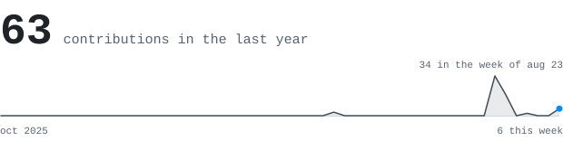
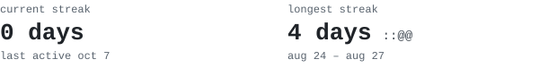
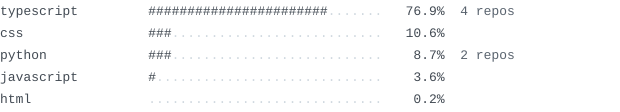
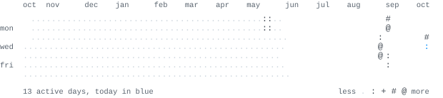

<!--
Contact links go here when you want them, for example:
[linkedin](https://www.linkedin.com/in/your-handle) &nbsp;&nbsp; [email](mailto:you@example.com)
-->

> Computer science student at the University of Wollongong in Dubai, 
> majoring in artificial intelligence and big data.

I build machine-learning models and the web apps that put them in front of 
people. The part I care about most is getting a model to explain itself: 
CardioLens predicts heart-disease risk and shows which factors pushed it up 
or down, so the number arrives with its reasons.

**[cardiolens-ai](https://github.com/arwin-tech/cardiolens-ai)** &nbsp; <samp>python, xgboost, shap, fastapi, react</samp> &nbsp; [demo](https://cardiolens-ai.vercel.app) 
Predicts cardiovascular risk from 11 health details and charts which factors 
raised or lowered it. 0.798 ROC-AUC on 14,000 held-out patients.

**[aether-ledger](https://github.com/arwin-tech/aether-ledger)** &nbsp; <samp>typescript, react, leaflet</samp> &nbsp; [demo](https://aether-ledger.vercel.app) 
A carbon-footprint calculator and a simulated 72-hour pollution map for the 
UAE, with air-purifier spots near schools and hospitals. BITS Tech Fest 2025.

**[unstuck](https://github.com/arwin-tech/unstuck)** &nbsp; <samp>typescript, next.js, gsap</samp> &nbsp; [demo](https://unstuck2026.vercel.app) 
For the hours between getting stuck on coursework and asking someone: it 
turns the stall into one specific question. Built for DesignAthon 2026.

**[uowd_odyssey](https://github.com/arwin-tech/uowd_odyssey)** &nbsp; <samp>typescript, react, framer-motion</samp> 
Front end for the UOWD Hackathon 2026 site, with teams, submissions, 
judging and admin all working in the browser.

<samp>python &nbsp; typescript &nbsp; react &nbsp; next.js &nbsp; fastapi &nbsp; xgboost &nbsp; scikit-learn &nbsp; shap &nbsp; tailwind &nbsp; vite</samp>

Every graphic here is drawn by this repository, not loaded from anyone 
else's server. The portrait is a photo pushed through a 13-character ramp by 
<samp>[make_portrait.py](scripts/make_portrait.py)</samp>; the numbers are redrawn each morning by
[a scheduled action](.github/workflows/refresh-stats.yml) 
straight from the GitHub API, which commits only when something changed. 
Built from [andriidrok1's guide](https://github.com/andriidrok1/andriidrok1).
